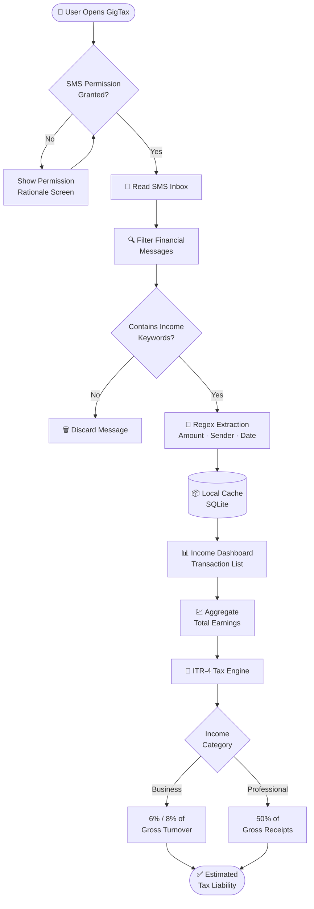
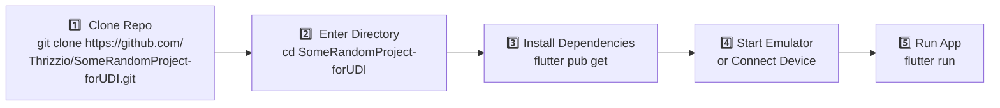
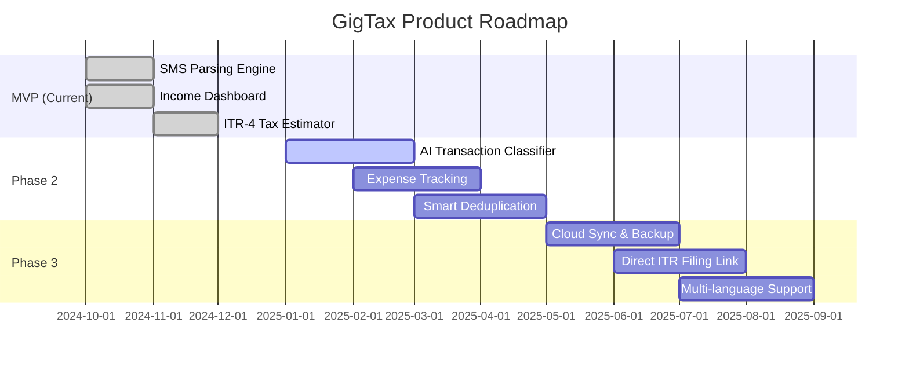

<div align="center">

<div style="background: linear-gradient(135deg, #1a1a2e 0%, #16213e 100%); padding: 20px 15px; border-radius: 15px; display: inline-block; margin-bottom: 20px;">


<br style="margin: 8px 0;" />


</div>

<br />

[](https://flutter.dev/)
[](https://dart.dev/)
[](https://developer.android.com/)
[](https://www.sqlite.org/)
[](https://pub.dev/packages/provider)
[]()


# 📃 GigTax

### *SMS-Powered Income Tracker & Tax Estimator for Gig Workers*

> **Extract → Classify → Aggregate → File**
> Turn your inbox into a tax-ready income ledger — no accountant needed.

<br />

[📱 View Demo](#-demo-flow) · [🚀 Quick Start](#-getting-started) · [🧾 Tax Logic](#-tax-estimation-itr-4) · [📄 LICENSE](LICENSE) · [🤝 Contributing](#-contributing)

</div>

---

## 📌 Table of Contents

- [The Problem](#-the-problem)
- [The Solution](#-the-solution)
- [Architecture](#%EF%B8%8F-architecture)
- [Features](#-features)
- [Tax Estimation (ITR-4)](#-tax-estimation-itr-4)
- [Tech Stack](#%EF%B8%8F-tech-stack)
- [Getting Started](#-getting-started)
- [Project Structure](#-project-structure)
- [Permissions](#-permissions)
- [Known Limitations](#%EF%B8%8F-known-limitations)
- [Roadmap](#-roadmap)
- [Demo Flow](#-demo-flow)
- [Contributing](#-contributing)
- [License](#-license)

---

## 🔥 The Problem

India has **~15 million** gig workers across platforms like Swiggy, Uber, Zomato, Urban Company, and Upwork. They face a financial trilemma that no existing product solves:

| Pain Point | Reality |
|---|---|
| 💔 **Fragmented Income** | Earnings split across 3–7 platforms with no unified view |
| 📭 **No Paper Trail** | Income is buried in SMS inboxes, not structured ledgers |
| 😰 **Tax Confusion** | Most don't know they qualify for ITR-4 presumptive taxation |
| 🔀 **Signal vs. Noise** | Income SMSes mixed with OTPs, offers, and personal credits |

**GigTax fixes this — from your SMS inbox, automatically.**

---

## 💡 The Solution

GigTax reads your SMS messages locally on-device, filters income-related transactions, and converts raw text into a structured financial dashboard — with live ITR-4 tax estimation.

```
📩 SMS Inbox  →  🔍 Smart Filter  →  💰 Income Ledger  →  🧾 Tax Estimate
```

No manual entry. No bank integration required. No data leaves your device.

---

## 🏗️ Architecture



---

## ✨ Features

### 📩 Intelligent SMS Parsing
- Reads the device SMS inbox via Android's native SMS API
- Filters messages using income-specific keyword detection (`credited`, `payout`, `received`, `earnings`, `transferred`)
- Handles multi-format sender IDs (e.g., `SWIGGY`, `UBERIND`, `AD-ICICIB`)

### 💰 Income Extraction Engine
- Extracts ₹ amounts using robust multi-pattern regex
- Captures sender ID, timestamp, and raw message body
- Deduplication-ready architecture (no double-counting same transaction)

### 📊 Live Income Dashboard
- Real-time transaction feed with amount, source, and date
- Monthly and cumulative earnings aggregation
- Color-coded source identification (platform vs. bank credit)

### 🧾 Tax Estimation (ITR-4 Presumptive)
- Supports all three presumptive taxation modes
- Instant taxable income calculation with slab breakdowns
- Visual summary of estimated tax liability

### 🔒 100% On-Device Processing
- No data transmitted to any server
- No login or account required
- GDPR/DPDP-aligned privacy-first design

---

## 🧾 Tax Estimation (ITR-4)

GigTax implements India's **Presumptive Taxation Scheme** under Section 44AD and 44ADA.

| Category | Applicable Section | Deemed Profit Rate | Eligible For |
|---|---|---|---|
| Digital Business | 44AD | **6%** of gross turnover | Swiggy, Zomato, Uber partners |
| Cash/Offline Business | 44AD | **8%** of gross turnover | Offline gig work |
| Professional Services | 44ADA | **50%** of gross receipts | Freelancers, consultants |

### Example Calculation

```
Gross Annual Income (SMS parsed) : ₹8,00,000
Category                         : Digital Business (Swiggy delivery)
Deemed Profit Rate               : 6%
─────────────────────────────────────────────
Taxable Income                   : ₹48,000
Tax Liability (Old Regime)       : ₹0 (below ₹2.5L basic exemption)
```

> ⚠️ **Disclaimer:** GigTax provides estimates only. Consult a qualified CA or tax professional before filing your ITR.

---

## 🛠️ Tech Stack

| Layer | Technology | Purpose |
|---|---|---|
| **UI Framework** | Flutter 3.x | Cross-platform mobile UI |
| **Language** | Dart | Business logic & parsing |
| **SMS Access** | `telephony` / `flutter_sms_inbox` | Android SMS API bridge |
| **Local Storage** | SQLite (via `sqflite`) | Persistent transaction store |
| **Parsing** | Dart RegExp engine | Amount & keyword extraction |
| **State Management** | Provider / Riverpod | Reactive UI updates |
| **Platform** | Android 6.0+ (API 23+) | Primary target |

---

## 🚀 Getting Started

### Prerequisites

- Flutter SDK `>=3.0.0`
- Android Studio / VS Code with Flutter extension
- Android device or emulator running API 23+
- `READ_SMS` permission enabled on test device

### Installation



```bash
# Step 1: Clone
git clone https://github.com/Thrizzio/SomeRandomProject-forUDI.git

# Step 2: Navigate
cd SomeRandomProject-forUDI

# Step 3: Install dependencies
flutter pub get

# Step 4: Connect device or start emulator
# (Ensure USB debugging is enabled on physical device)

# Step 5: Run
flutter run
```

### Testing SMS Parsing (Emulator)

Since emulators don't have real SMS, use ADB to inject test messages:

```bash
# Send a test income SMS via ADB
adb emu sms send SWIGGY "Your earnings of Rs.340.00 have been credited to your bank account."

# Send a Uber payout SMS
adb emu sms send UBERIND "Congrats! Rs.1250 has been transferred to your account ending 4321."
```

---

## 📁 Project Structure

```
gigtax/
├── lib/
│   ├── main.dart                  # App entry point
│   ├── models/
│   │   └── transaction.dart       # Transaction data model
│   ├── services/
│   │   ├── sms_reader.dart        # SMS inbox access
│   │   ├── sms_parser.dart        # Regex extraction engine
│   │   └── tax_calculator.dart    # ITR-4 tax logic
│   ├── providers/
│   │   └── income_provider.dart   # State management
│   ├── screens/
│   │   ├── dashboard_screen.dart  # Main income view
│   │   ├── tax_screen.dart        # Tax estimation UI
│   │   └── permission_screen.dart # SMS permission flow
│   └── widgets/
│       ├── transaction_card.dart  # Individual SMS card
│       └── summary_banner.dart    # Earnings summary
├── android/
│   └── app/src/main/
│       └── AndroidManifest.xml    # SMS permissions declared
├── pubspec.yaml                   # Dependencies
└── README.md
```

---

## 🔐 Permissions

GigTax requires the following Android permissions:

| Permission | Why It's Needed |
|---|---|
| `READ_SMS` | To scan existing SMS inbox for income messages |
| `RECEIVE_SMS` | To detect and parse new incoming income SMSes in real-time |

> 🛡️ **Privacy Commitment:** All SMS processing happens **100% on-device**. No message content, phone number, or financial data is ever transmitted to any external server or third party.

---

## ⚠️ Known Limitations

- **SMS Format Variance** — Each platform uses different message templates; some edge cases may be missed
- **False Positives** — Personal credits (gifts, refunds) may be misclassified as income
- **No Deduplication (MVP)** — The same payout may appear in both bank and platform SMS
- **Android-Only** — iOS restricts third-party SMS access at the OS level
- **API 23+ Required** — Runtime permission model not available on older Android
- **No Expense Tracking** — Only income-side visibility in MVP

---

## 🗺️ Roadmap



| Phase | Feature | Status |
|---|---|---|
| ✅ MVP | SMS Parsing + Income Dashboard + Tax Estimation | **Done** |
| 🔄 Phase 2 | AI-based transaction classification (income vs. personal) | Planned |
| 🔄 Phase 2 | Expense tracking (platform fees, fuel, data) | Planned |
| 🔄 Phase 2 | Smart deduplication (bank + platform SMS) | Planned |
| 🔜 Phase 3 | Cloud backup & cross-device sync | Planned |
| 🔜 Phase 3 | Pre-filled ITR-4 export (JSON / PDF) | Planned |
| 🔜 Phase 3 | Hindi & regional language SMS support | Planned |

---

## 🎮 Demo Flow

```
Launch GigTax
     │
     ▼
Grant READ_SMS Permission
     │
     ▼
App Scans SMS Inbox
     │
     ├── Finds "Rs.340 credited" from SWIGGY
     ├── Finds "Rs.1250 transferred" from UBERIND
     └── Ignores OTPs, promotional messages
     │
     ▼
Displays Parsed Transaction List
┌─────────────────────────────────────┐
│ 🟢 SWIGGY    ₹340    Oct 12, 2024  │
│ 🟢 UBERIND   ₹1250   Oct 14, 2024  │
│ 🟢 SWIGGY    ₹520    Oct 16, 2024  │
└─────────────────────────────────────┘
     │
     ▼
Shows Total: ₹2,110 this month
     │
     ▼
Estimated Taxable Income: ₹1,266 (6% presumptive)
```

---

## 🤝 Contributing

Contributions are welcome! Here's how to get started:

```bash
# Fork the repository, then:
git checkout -b feature/your-feature-name
git commit -m "feat: describe your change"
git push origin feature/your-feature-name
# Open a Pull Request
```

Please follow [Conventional Commits](https://www.conventionalcommits.org/) and open an issue before major changes.

---

## 📄 License

This project is licensed under the **MIT License** — see the [LICENSE](LICENSE) file for details.

---

<div align="center">

Built with ❤️ for India's gig economy

**GigTax** · [Report Bug](https://github.com/Thrizzio/SomeRandomProject-forUDI/issues) · [Request Feature](https://github.com/Thrizzio/SomeRandomProject-forUDI/issues)

</div>
